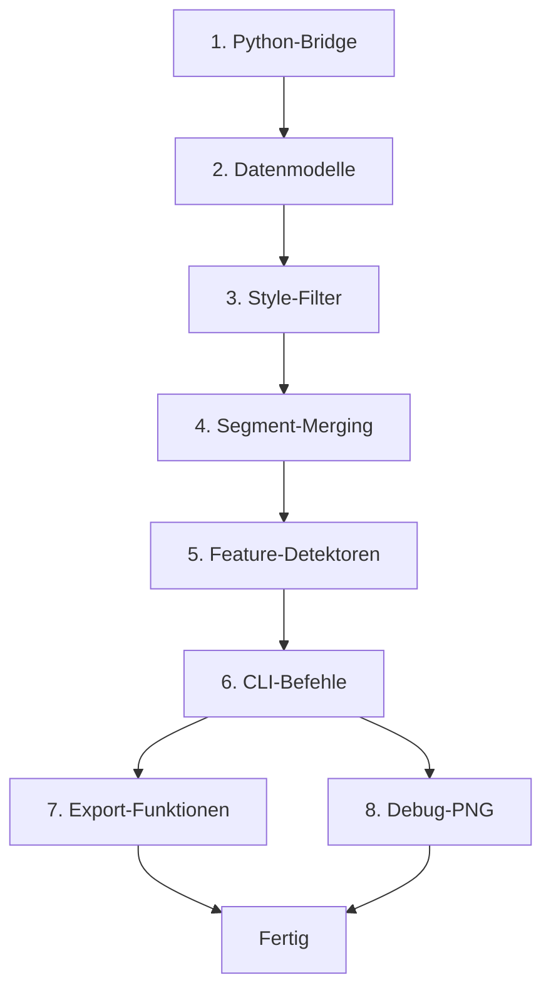

# Todo-Liste: TypeScript CLI Pipeline für PDF-Extraktion

## Status-Übersicht

| Hauptbereich | Anzahl Tasks | Abgeschlossen |
|--------------|--------------|--------------|
| Python-Bridge | 4 | 0 |
| TypeScript Datenmodelle | 6 | 0 |
| Style-Filter-Logik | 6 | 0 |
| Segment-Merging | 6 | 0 |
| Feature-Detektoren | 11 | 0 |
| CLI-Befehle | 13 | 0 |
| Export-Funktionen | 8 | 0 |
| Debug-PNG Renderer | 4 | 0 |
| **Gesamt** | **58** | **4** |

---

## Abgeschlossene Tasks

[x] 0.1 Projekt-Analyse und Dokumentation sichten  
[x] 0.2 Architektur-Plan erstellen (Hybrid vs Vollständig TypeScript)  
[x] 0.3 Daten-Schema und TypeScript Interfaces definieren  
[x] 0.4 CLI-Befehle und Projekt-Struktur entwerfen  
[x] 0.5 **Architektur-Entscheidung: Python + TypeScript Hybrid**

---

## 1. Python-Bridge für Subprocess-Kommunikation implementieren

[-] 1.1 Subprocess-Helper-Funktion in TypeScript erstellen (src/cli/utils/subprocess.ts)  
[ ] 1.2 Python-Skript-Signatur definieren (JSON-Eingabe/JSON-Ausgabe)  
[ ] 1.3 Fehlerbehandlung für Python-Prozessfehler implementieren  
[ ] 1.4 Unit-Tests für Subprocess-Kommunikation schreiben

---

## 2. TypeScript Datenmodelle definieren

[ ] 2.1 Drawing-Interface erstellen (src/core/models/drawing.ts)  
[ ] 2.2 Text-Interface erstellen (src/core/models/text.ts)  
[ ] 2.3 Feature-Interface erstellen (src/core/models/feature.ts)  
[ ] 2.4 Style-Interface erstellen (src/core/models/style.ts)  
[ ] 2.5 Geometry-Typen (Point, Rect, Polyline, Polygon) definieren  
[ ] 2.6 Alle Interfaces in src/types/index.ts exportieren

---

## 3. Style-Filter-Logik portieren

[ ] 3.1 Style-Clustering-Funktion implementieren (src/core/filters/style-cluster.ts)  
[ ] 3.2 Box-Filter (gelbe Maßnahmen-Boxen) portieren  
[ ] 3.3 Mast-Symbol-Filter portieren  
[ ] 3.4 Axis/Edge-Filter portieren  
[ ] 3.5 Dimension-Filter portieren  
[ ] 3.6 Helper-Funktionen (get_color_value, isclose) in TypeScript übersetzen

---

## 4. Segment-Merging Algorithmus implementieren

[ ] 4.1 Quantisierungs-Funktion für Punkt-Clustering erstellen  
[ ] 4.2 Graph-Datenstruktur für Segmente aufbauen (src/core/merging/segment-graph.ts)  
[ ] 4.3 Union-Find oder DFS für Komponenten-Suche implementieren  
[ ] 4.4 Pfad-Rekonstruktion (Grad-1-Endpunkte entlanglaufen)  
[ ] 4.5 Optional: Douglas-Peucker-Simplifizierung  
[ ] 4.6 Mastnähe-Punkte schützen (Ausnahme-Liste)

---

## 5. Feature-Detektoren implementieren

[ ] 5.1 AxisDetector-Klasse (src/core/detection/axis-detector.ts)  
    [ ] 5.1.1 Style-Clustering für Achsen-Erkennung  
    [ ] 5.1.2 Segment-Merging aufrufen  
    [ ] 5.1.3 Achsen-Polyline validieren  
[ ] 5.2 EdgeDetector-Klasse (src/core/detection/edge-detector.ts)  
    [ ] 5.2.1 Style-Clustering für Außenlinien  
    [ ] 5.2.2 Segment-Merging aufrufen  
    [ ] 5.2.3 Links/Rechts-Trennung über Achsen-Abstand  
[ ] 5.3 MastDetector-Klasse (src/core/detection/mast-detector.ts)  
    [ ] 5.3.1 Quadrat-Erkennung (4 Segmente)  
    [ ] 5.3.2 Mastzentrum berechnen  
[ ] 5.4 MeasureDetector-Klasse (src/core/detection/measure-detector.ts)  
    [ ] 5.4.1 Spatial Clustering für Bemaßungs-Gruppen  
    [ ] 5.4.2 Haupt-Maßlinie bestimmen  
    [ ] 5.4.3 Text-Findung parallel zur Maßlinie

---

## 6. CLI-Befehle implementieren

[ ] 6.1 CLI-Framework auswählen (commander oder gluegun)  
[ ] 6.2 extract-Befehl (src/cli/commands/extract.ts)  
    [ ] 6.2.1 PDF-Datei-Validierung  
    [ ] 6.2.2 Python-Subprocess aufrufen  
    [ ] 6.2.3 JSON-Ausgabe speichern  
[ ] 6.3 detect-Befehl (src/cli/commands/detect.ts)  
    [ ] 6.3.1 JSON-Eingabe laden  
    [ ] 6.3.2 Alle Detektoren aufrufen  
    [ ] 6.3.3 Feature-Linking (Mast-Achse, Maßnahme-Schutzstreifen)  
    [ ] 6.3.4 JSON-Ausgabe speichern  
[ ] 6.4 export-Befehl (src/cli/commands/export.ts)  
    [ ] 6.4.1 Format-Argument parsen (json/geojson/png)  
    [ ] 6.4.2 Entsprechenden Exporter aufrufen  
[ ] 6.5 process-Befehl (All-in-One)  
    [ ] 6.5.1 extract → detect → export verketten

---

## 7. JSON und GeoJSON Export-Funktionen erstellen

[ ] 7.1 JSON-Exporter (src/export/json-exporter.ts)  
    [ ] 7.1.1 Feature-Array in JSON serialisieren  
    [ ] 7.1.2 Metadaten hinzufügen  
[ ] 7.2 GeoJSON-Exporter (src/export/geojson-exporter.ts)  
    [ ] 7.2.1 Feature → GeoJSON Feature konvertieren  
    [ ] 7.2.2 Point für Masten  
    [ ] 7.2.3 LineString für Achse/Außenlinien  
    [ ] 7.2.4 Polygon für Schutzstreifen/Maßnahmen  
    [ ] 7.2.5 Properties mappen

---

## 8. Debug-PNG Renderer implementieren

[ ] 8.1 PNG-Generierung mit Canvas oder sharp  
[ ] 8.2 Vektor-Overlays zeichnen (Achse=rot, Außenlinien=orange, etc.)  
[ ] 8.3 Text-Labels hinzufügen  
[ ] 8.4 Debug-Modus: Original-PDF vs Erkennung vergleichen

---

## Abhängigkeiten

---

## Letzte Aktualisierung

- **Datum**: 2026-02-11
- **Version**: 1.0
- **Status**: Planungsphase abgeschlossen
